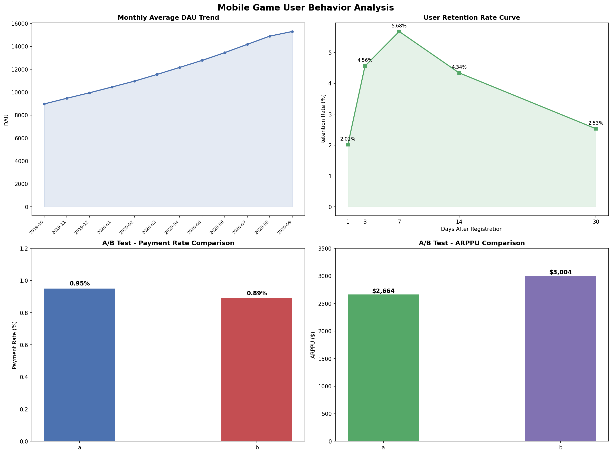

# 手游用户行为数据分析

## 项目简介
基于 Gamelytics 手游平台真实数据，分析 2019-10 至 2020-09
用户活跃度、留存与付费表现，结合 A/B 测试结果为运营决策提供支撑。

## 核心发现
- 📈 月均 DAU 从 8,979 增长至 15,298，12 个月增长 **70%**
- ⚠️ 次日留存仅 **2.01%**，7 日内流失率高达 **76.38%**
- 💰 付费率 **0.92%**，ARPPU **$2,828**；A 组付费率更高，B 组客单价更高

## 技术栈
- Python（Pandas）：数据清洗、留存率与付费指标计算
- Matplotlib：生成 4 张可视化图表
- 核心指标：DAU、新增用户、次日/7/14/30日留存、流失率、付费率、ARPU、ARPPU

## 数据来源
[Gamelytics - Kaggle](https://www.kaggle.com/datasets/debs2x/gamelytics-mobile-analytics-challenge)
数据规模：注册 100 万用户，登录 960 万条记录，A/B测试 40 万用户

## 图表预览

